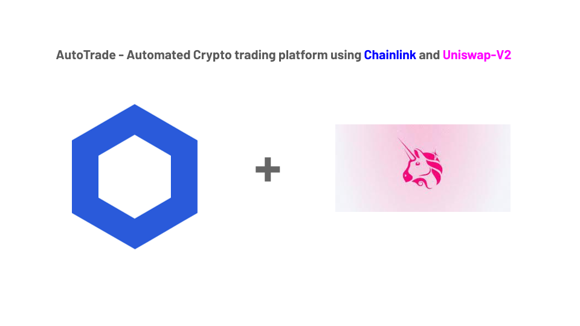

# Automated crypto trade By Chainlink decentralized oracles and Uniswap-V2 protocol

AutoTrade used Chainlink Oracles and Uniswap-V2 to set up a trustless automated crypto trading platform without requiring the user to pass minimum return value for safety.

Uniswap works on ERC20-ERC20 pair. So, If you want to trade you need to pass minimum return value for safety, deadline and Path of the token. AutoTrade removes these all hurdles.

Traders will add value for any token. Like if trader wants to trade for DAI to Link then He/she add number of DAI. The platform will calculates uniswap reserve amountOut and Chainlink pricing refrence data for that pair(DAI->Link). From both these prices it will calculate slippage rate. If the slippage rate <=2 then automated trade occur otherwise it will show slippage is too high.

for e.g. DAI -> LINK
User wants for 100 DAI
Platform calculates 2 prices for LINK token
- Uniswap will give `execution price` 15.9 LINK token for 100 DAI.
- Chainlink will say `acutual expected price` should be 16.0 LINK token for 100.  
- Platform will calculate slippage rate from above these prices difference.
- so, slippage is 0.625% which is <=2. So, trade will occur successfully. 
- and if it is not <=2 then it gives error `sliipage is too hogh`.
`note: Slippage refers to the difference between the expected price of a trade and the price at which the trade is executed.`

Even using platform, Liquidity providers can manage pools like they can deposit or sell liquidity to earn interests. But while add liquidity for token pair whatever value `you add for one token so parallelly it calculates same price of second token from chainlink oracle.` So platform will maintain or `balance liquidity using chainlink price feeds`.
 
Platform also saves trade transaction history and provides all transaction details in a single place in platform.

## How was it made?

I have used Chainlink Oracles and Uniswap-V2 protocol to build automated trading platform. AutoTrade is supporting a trading crypto pair using Uniswap smart contract and for fetch latest price feed from chainlink oracles. So, Using platform liquidity providers can add and remove liquidity and traders can perform trade using smart contract. 

Platform is using web3.js library to interact eith smart contracts. 

I used Next.js and Semantic UI react to design the frontend. And for saving the trade transaction history, I write node.js API and saves history in mongodb database.

# Video Demo

https://youtu.be/cn7UgN33Ys8  

## How to run

1. Clone repo `https://github.com/sunnyRK/ChainLinkRefrence.git`
2. `cd ChainLinkRefrence`
3. `npm install`
4. `node server.js`
5. Currently deployed on Kovan Network

## Future Task

1. Get Liquidity from other protocols(AAVE, Compound)
2. Use ENS(Ethreum name service) to give more flexibilty to user

## Tech stack

Ethereum   
Solidity   
Web3.js  
Chainlink Price feed and Decentralized Oracles 
Uniswap-V2  
nodejs api  
MongoDB  
Next.Js  
Semantic UI React

